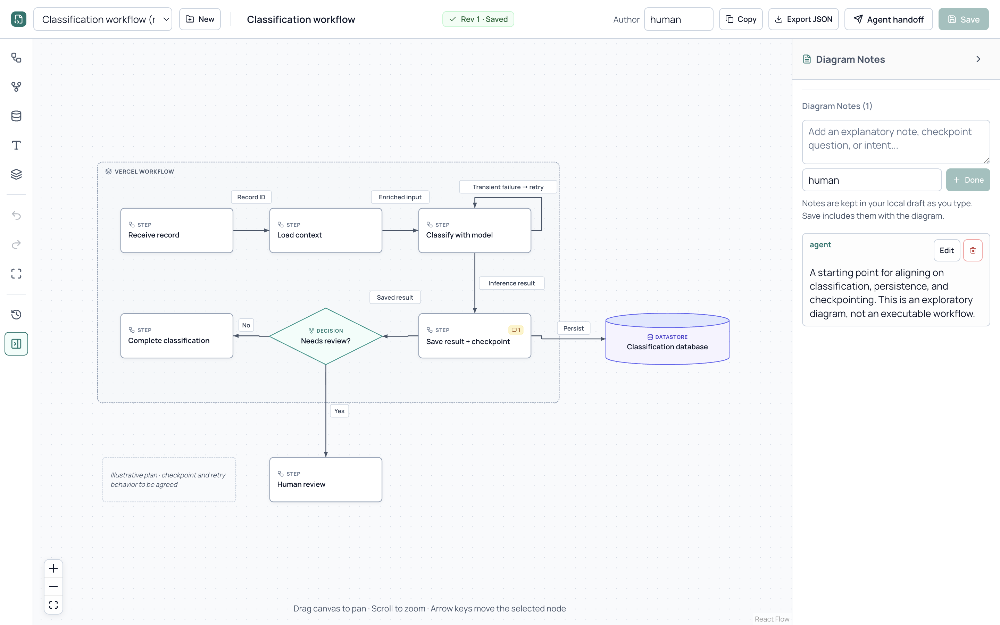

# Diagram Bridge

**A local planning canvas for you and your coding agents.**

Draw a workflow, attach a question to a step, and save. Your agent reads the diagram and its changes through a CLI, then responds with targeted edits and notes. You both work on the same revisioned document.



- **Visual editing:** steps, decisions, databases, groups, labeled connections, and anchored notes.
- **Agent collaboration:** structured JSON, revision diffs, PNG snapshots, and atomic edit batches.
- **Recoverable work:** local drafts, revision history, guarded writes, and explicit conflict recovery.
- **Local storage:** SQLite in your project. No account, API key, or hosted service required.

## Install

Requires **Node.js 24 or later** and npm. Check with `node --version`. Download Node.js from [nodejs.org](https://nodejs.org/).

### Prebuilt download

Download **`diagram-bridge-0.1.1.tgz`** from the [latest release](https://github.com/brandongalang/diagram-bridge/releases/latest). In the directory containing the downloaded file:

```sh
npm install -g ./diagram-bridge-0.1.1.tgz
diagram --help
```

The archive contains the compiled CLI, editor, schemas, and examples. npm installs its runtime dependencies; a source build is unnecessary.

### Build from source

```sh
git clone https://github.com/brandongalang/diagram-bridge.git
cd diagram-bridge
npm ci
npm run build
node dist/cli.js --help
```

GitHub's **Code → Download ZIP** also works: extract it, open a terminal in that folder, and run the last three commands. Use `node dist/cli.js` wherever the instructions below say `diagram`, or install the built checkout globally with `npm install -g .`.

## Open your first diagram

Choose the folder where you want to keep your diagrams. These commands create a `my-plans` folder under your terminal's working directory:

```sh
diagram init ./my-plans
diagram create "My first plan" --workspace ./my-plans
diagram serve --workspace ./my-plans
```

Leave that terminal running. In a second terminal **in the same working directory**:

```sh
diagram open --workspace ./my-plans
```

The editor opens in your default browser. Click **Add first step**, edit its label, and add notes in the inspector. Save with **Cmd/Ctrl+S**. Drag nodes to arrange the plan; connect them using the handles on their borders. **New** creates another diagram, and the document menu switches between them.

`serve` runs until you press **Ctrl+C**. To return later, start `serve` and run `open` again. `diagram list --workspace ./my-plans` shows document IDs; pass an ID to `open` to select a specific diagram.

From a source checkout, try the included example:

```sh
node dist/cli.js create "Classification workflow" --from examples/classification/document.json --workspace ./my-plans
node dist/cli.js open --workspace ./my-plans
```

Select **Classification workflow** in the document menu if another diagram is open.

## Work with a coding agent

1. Edit the diagram and attach questions or instructions as notes.
2. **Save**, open **Agent handoff**, and copy its instructions into your agent conversation.
3. Ask the agent to review the saved revision and apply its response.
4. Read the agent's changes in the editor, then save your next response.

The handoff includes the exact workspace, document ID, and saved revision. Later handoffs include a diff from the last copied revision. Your agent needs terminal access to the same workspace and an installed `diagram` command; it can also invoke `node /path/to/diagram-bridge/dist/cli.js`.

Typical agent commands, run inside an initialized workspace:

```sh
diagram pull DOCUMENT_ID --since 1 --brief --json
diagram schema operations
diagram apply DOCUMENT_ID --file edits.json --base-revision 2 --request-id review-001 --dry-run --json
diagram apply DOCUMENT_ID --file edits.json --base-revision 2 --request-id review-001 --json
```

Replace `DOCUMENT_ID` and revision numbers with the values from the handoff. `edits.json` contains the agent's operation batch. Preview validates it without writing; apply commits the entire batch or rejects it. If another revision arrives first, a stale write fails and your draft stays intact. Clean editors load saved agent changes automatically.

Agents read and write committed revisions without a running editor server. There is no automatic agent dispatch: you decide when to send a handoff. Diagram content describes a plan; it does not execute that plan.

See the [agent command guide](docs/agent-usage.md) and [JSON contracts](docs/contracts.md).

## Export and share

Portable JSON preserves nodes, connections, notes, and positions:

```sh
diagram export DOCUMENT_ID --output plan.json --workspace ./my-plans
diagram create "Imported plan" --from plan.json --workspace ./my-plans
```

For PNG snapshots, install the matching Chromium renderer once. From a source checkout:

```sh
npm run browser:install
```

For the prebuilt 0.1.1 package:

```sh
npx --yes playwright@1.63.0 install chromium
```

Then render an exact saved revision:

```sh
diagram snapshot DOCUMENT_ID --revision 2 --output plan.png --workspace ./my-plans
```

PNG export works with the editor closed. After dependencies and Chromium are installed, editing and export run without external services. On Linux, Playwright may also need system libraries; use its `install --with-deps chromium` command if prompted.

## Data and recovery

Saved diagrams live in `<workspace>/.diagram-bridge/diagrams.sqlite`. Each save creates an immutable revision. Add `.diagram-bridge/` to your project's `.gitignore` to keep diagrams and local access credentials out of source control.

For backups, stop the server and other diagram writers before copying `.diagram-bridge/`, or export individual diagrams to JSON. Browser drafts live in localStorage for the workspace's local address. Keep the same port and browser profile to recover them after restarting.

Conflicting saves preserve your draft and offer copying, JSON export, or explicit discard. Retry after an uncertain save uses the same request payload to avoid duplicate commits. Keep browser storage until you have saved or exported any work you need.

The server listens on loopback. URLs returned by `open` contain a local access token; use exported JSON or PNG files when sharing with others.

## Troubleshooting

| Problem | Fix |
| --- | --- |
| `diagram: command not found` | Use `node dist/cli.js` from the built source checkout, or check that npm's global bin directory is on your PATH. |
| Node / SQLite startup error | Check `node --version`; Node.js 24+ is required. Node may print an experimental SQLite warning. |
| Editor cannot load or access expired | Keep `diagram serve` running and run `diagram open` again to obtain a fresh access URL. |
| Browser does not open | Run `diagram open --no-browser` and paste its returned URL into your browser. Add `--workspace` if needed. |
| Port is occupied | Stop the other process. You can choose a port with `diagram serve --port 31786`; save or export browser drafts before changing their origin. |
| PNG renderer is missing | Install the matching Chromium version using the instructions above. Chromium is optional for canvas editing and JSON commands. |
| Stale revision conflict | Pull the latest revision and review it. Preserve your local work with Copy or Export JSON before discarding a draft. |

## Development

```sh
npm ci
npm run typecheck
npm test
npm run build
npm run browser:install
npm run test:package
```

The package smoke check installs the release archive into a temporary directory, then exercises its CLI and PNG renderer outside the checkout. Browser interaction tests are also available through `npm run test:e2e`.

The implementation uses TypeScript, React Flow, Node's built-in SQLite, and Playwright for image export. Tests cover graph validation, routing, revisions, concurrent writes, retry behavior, CLI contracts, and editor recovery. Desktop browser behavior has been exercised on macOS; physical mobile devices and native Windows setup have not been verified.

This is an early release for local planning. Cloud collaboration, automatic layout, MCP integration, and executable workflows are outside its scope. Report reproducible bugs or propose focused improvements through [GitHub issues](https://github.com/brandongalang/diagram-bridge/issues).

## License

[MIT](LICENSE) © Brandon Galang.
